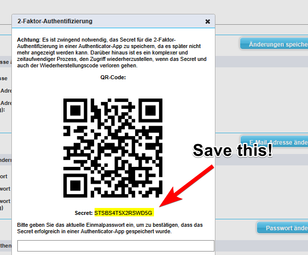

# Certbot Contabo authenticator plugin

This is a Certbot plugin to automate DNS-01 challenges for domains whose DNS is managed by Contabo. It works by
interacting with the Contabo web interface through web scraping, as Contabo does not currently offer an official API for
DNS management.

## Important

* **Web Scraping**: This plugin relies on web scraping Contabo's website. If Contabo changes its
  website structure, this plugin may break until it's updated. The plugin is designed based on their current
  interface, which has been relatively stable for years.

## Installation

You can install the plugin using pip:

```bash
pip install certbot-dns-contabo
```

## Usage

Create a credentials file like this, for example using `nano /etc/letsencrypt/contabo.ini`:

```ini
dns_contabo_email = your-contabo-email@example.com
dns_contabo_password = your-contabo-password
dns_contabo_2fa_secret = your-contabo-2fa-secret (optional, only if you have 2FA enabled; see below on how to get this!)
```

Since this file contains sensitive credentials, protect it by restricting its permissions:

```bash
sudo chmod 600  /etc/letsencrypt/contabo.ini
```

(Replace `/etc/letsencrypt/contabo.ini` if you saved it in a different location.)

To request a certificate, use Certbot with the `dns-contabo` authenticator.

**Example for `example.com` and `*.example.com` (wildcard):**

```bash
sudo certbot certonly \
  --authenticator dns-contabo \
  --dns-contabo-credentials /etc/letsencrypt/contabo.ini \
  -d example.com \
  -d "*.example.com" 
```

## Disclaimer
I am not affiliated with Contabo in any way. This plugin can stop working at any time if Contabo changes their website,
which *could* even lead to stuff breaking on your Contabo account. 


## Getting the 2FA secret
If you have 2FA enabled on your Contabo account, you need to provide the 2FA secret in the credentials file.
You can get the secret my navigating to your Contabo account settings (https://my.contabo.com/account/details), and
scrolling down to "2-Faktor-Authentifizierung neu setzen" (at least in German, the English version should be similar).  
  
This will show you a QR code and a secret key. Save the secret key in your credentials file as dns_contabo_2fa_secret.  
  
**Very important**: You will have to add the new 2FA-QR-code in your authenticator app again!